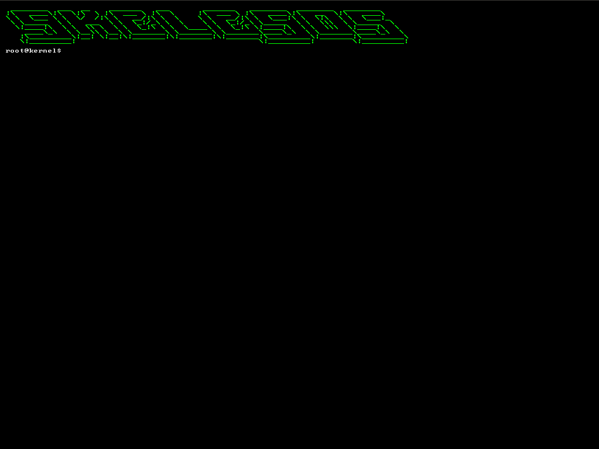

 

# What is Skeles?
Skeles is a hobby OS with VESA/VBE support and GRUB booting.

# Screenshots

# License
The license is GNU GPL 3.0, which means you can use the code in any purposes as long as you provide access to original sources.

# I want to try it!
Check the `Releases` tab. There is a release. Also, if you want to build it by yourself, run the `iso.sh` script.

# How to contribute?
Feel free to fork the repo and send PRs to me - I'll try to merge the most relevant ones.

# Roadmap
I plan to:
 * [x] To use 1024x768 video mode
 * [x] To do memory management
 * [ ] To setup GDT/IDT
 * [ ] To create FAT32 or Ext2 filesystem driver.
 * [ ] To create fancy GUIs
 * [ ] To write an application loader.